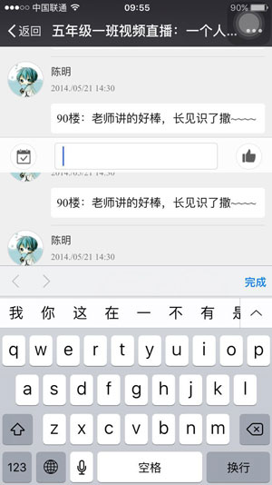

* content
{:toc}

学习web前端开发基础技术需要掌握：HTML、CSS、JavaScript语言。下面我们就来了解下这三门技术都是用来实现什么的：


1. HTML是网页内容的载体。内容就是网页制作者放在页面上想要让用户浏览的信息，可以包含文字、图片、视频等。

2. CSS样式是表现。就像网页的外衣。比如，标题字体、颜色变化，或为标题加入背景图片、边框等。所有这些用来改变内容外观的东西称之为表现。

3. JavaScript是用来实现网页上的特效效果。如：鼠标滑过弹出下拉菜单。或鼠标滑过表格的背景颜色改变。还有焦点新闻（新闻图片）的轮换。可以这么理解，有动画的，有交互的一般都是用JavaScript来实现的。

在前端开发中html、css、js缺一不可。本文简单总结下html所包含的的基本内容。

我们平时上网就是浏览各种各样的网页，这些网页都是由html标签组成的。html中的标签是成对出现的，分开始标签和结束标签，标签和标签之间可以相互嵌套。

## html文件的基本结构

```
<!-- DOCTYPE位于文档中最前面位置，告知浏览器文档使用哪种HTML或XHTML规范 -->
<!DOCTYPE HTML>
<html>
	<!-- head 文档头部，描述了文档的各种属性和信息 -->
    <head>
    	<!-- 声明文档使用的字符编码 -->
        <meta http-equiv="Content-Type" content="text/html; charset=utf-8">
        <!-- 百度禁止转码 -->
        <meta http-equiv="Cache-Control" content="no-siteapp" />
		<!-- 优先使用 IE 最新版本和 Chrome -->
        <meta http-equiv="X-UA-Compatible" content="IE=edge,chrome=1">
        <!-- 页面描述内容 ，有利于seo-->
        <meta name="description" content="">
        <!-- 页面关键词 ，有利于seo-->
        <meta name="keywords" content="">
        <!-- viewport 可以让布局在移动浏览器上显示的更好。 -->
        <meta name="viewport"
        content="width=device-width, initial-scale=1, maximum-scale=1, user-scalable=no">
        <title>认识html文件基本结构</title>
        <link rel="stylesheet" href="xxx.css">
    </head>
    <body>
        <h1>认识html文件基本结构</h1>
        <script src="xxx.js"></script>
    </body>

</html>
```

## html的常用标签

```
<!DOCTYPE html>
<html lang="en">
<head>
	<meta charset="UTF-8">
	<title>html常用标签</title>
</head>
<body>
	<div>块</div>
	
	<a href="#">a标签（链接、下载、锚点）</a>
	<!-- 从h1~h6字体大小逐渐变小，强调作用也逐渐减弱，相比，h1标签对seo更好，但一个页面最好只用一个h1 -->
	<h1>标题1</h1>
	<h2>标题2</h2>
	<h3>标题3</h3>
	<h4>标题4</h4>
	<h5>标题5</h5>
	<h6>标题6</h6>
	
	<p>段落</p>

	<strong>强调 （页面展示为粗体，语气相对强烈）</strong>
	<em>强调（页面显示为斜体，语气相对较弱）</em>

	<span style="color: red">针对某些文字加颜色，用来区分样式</span>

	<!-- 有序列表 -->
	<ol>
		<li>列表项</li>
		<li>列表项</li>
		<li>列表项</li>
	</ol>

	<!-- 无序列表 -->
	<ul>
		<li>列表项</li>
		<li>列表项</li>
		<li>列表项</li>
	</ul>

	<!-- 定义列表 -->
	<dl>
		<dt>定义列表标题</dt>
		<dd>定义列表项</dd>
	</dl>


</body>
</html>
```

## html5新增标签

只列举一些常用的：


**&lt;header&gt;** 标签定义 section 或 document 的页眉。

**&lt;article&gt;** 标签定义外部的内容。比如来自一个外部的新闻提供者的一篇新的文章，或者来自 blog 的文本，或者是来自论坛的文本。亦或是来自其他外部源内容。

**&lt;aside&gt;** 标签定义 article 以外的内容。aside 的内容应该与 article 的内容相关。

**&lt;section&gt;** 标签定义文档中的节（section、区段）。比如章节、页眉、页脚或文档中的其他部分。

**&lt;nav&gt;** 标签定义导航链接的部分。

**&lt;footer&gt;** 标签定义 section 或 document 的页脚。典型地，它会包含创作者的姓名、文档的创作日期以及/或者联系信息。

**&lt;figure&gt;**  标签用于对元素进行组合。

**&lt;figcaption&gt;** 定义 figure 元素的标题

**&lt;video&gt;** 标签定义视频，比如电影片段或其他视频流。

**&lt;audio&gt;** 标签定义音频，比如电影片段或其他视频流。

**&lt;canvas&gt;** 标签定义图形，比如图表和其他图像。


通过以上标签可以看出html5新增了很多语义化的标签，然而我们通过div定义样式，也能够实现相同的样式，那为什么还要用这些语义化？

首先说下什么是语义化

语义化是指用合理HTML标记以及其特有的属性去格式化文档内容。通俗地讲,语义化就是对数据和信息进行处理,使得机器可以理解.（摘自百度百科）

#### 为什么要语义化

1. 为了在没有CSS的情况下，页面也能呈现出很好地内容结构、代码结构:为了裸奔时好看；
2. 用户体验：例如title、alt用于解释名词或解释图片信息、label标签的活用；
3. 有利于SEO：和搜索引擎建立良好沟通，有助于爬虫抓取更多的有效信息：爬虫依赖于标签来确定上下文和各个关键字的权重；
4. 方便其他设备解析（如屏幕阅读器、盲人阅读器、移动设备）以意义的方式来渲染网页；


